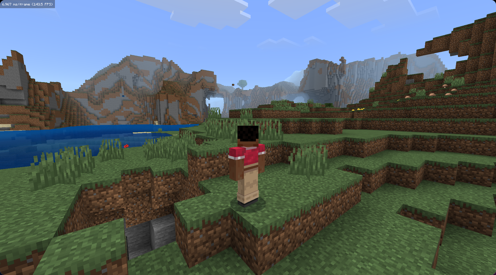

# Old Console WorldGen

Re-implementation of a Minecraft Legacy Console Edition world generation based on https://github.com/smartcmd/MinecraftConsoles to be used in AllayMC.

Original generation

Allay reimplementation

# Features

- Biomes
- Terrain noise
- Caves and canyons
- Ores
- Trees, tall grass, flowers, mushrooms, reeds, cactus, pumpkins, water lilies, and jungle vines

# Not supported

- Villages, strongholds, temples, mineshafts, or any other structures
- Lakes and dungeons
- Nether or End generation
- Exact block-for-block parity with the original client

# Install

- Download .jar file from releases
- Put it into ./plugins folder
- Create a world in ./worlds/world-settings.yml with `generator-type: OLD_CONSOLE_OVERWORLD` and `generator-preset: seed=<your-seed-here>`
- Restart the server
- Enjoy!

